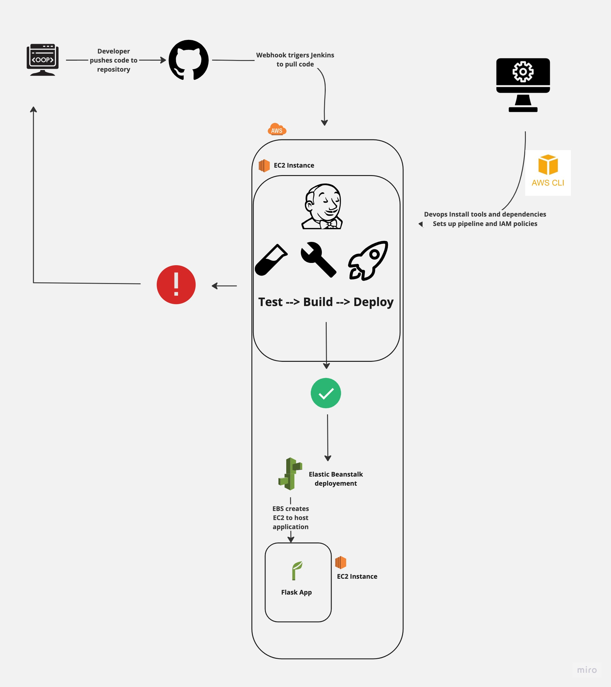

# Deploying a Jenkins Service and Elastic Beanstalk Application

Summary

The app in this repository is used to automate a build and test on jenkins and a deploy to Elastic Beanstalk with awsebcli

These are the steps

1. Create an AWS EC2 instance.
2. Installing a Jenkins service on the EC2 instance.
3. Creating a multibranch pipeline on Jenkins
4. Install the aws cli and awsebcli on the Jenkins server
5. Adding IAM service roles for EC2 and EBS
6. Creating a Jenkinsfile with a Deploy stage that uses the awsebcli to trigger a deployment to EBS
7. Using the Github plugin for Jenkins to set up a webhook that trigger a deployement when a push happens on main



## AWS EC2

Create EC2 instance to host the Jenkins service

- From the EC2 dashboard click on 'Launch Instance'
- Name your instance
- Select an Ubuntu image
- Select and t2.Micro instance type. This is a very small application so we don't need much.
- Select a key pair to be able to login to the instance
- Select a security group or set a security that allows inbound traffic over SSH and HTTP traffic on port 22 and 80 respectively
- Launch the instance

## Jenkins

Access your EC2 instance's terminal through instance connect. We'll set up the linux environment to install Jenkins.

[Official Jenkins Install docs](https://www.jenkins.io/doc/book/installing/linux/)

Update linux dependency manager

```bash
sudo apt-get update
```

Install Java

- This is a jenkins dependency

```bash
sudo apt install openjdk-17-jre
```

Install venv for python 3.10.
-This is used to create virtual python environment and run the pip commands for the test and build of the flask application

- This will also install python 3.10

```bash
sudo apt-get install python3.10-venv
```

Install Jenkins

- These curl and apt-get commands downloads and installs jenkins

```bash
curl -fsSL https://pkg.jenkins.io/debian-stable/jenkins.io-2023.key | sudo tee \
  /usr/share/keyrings/jenkins-keyring.asc > /dev/null
echo deb [signed-by=/usr/share/keyrings/jenkins-keyring.asc] \
  https://pkg.jenkins.io/debian-stable binary/ | sudo tee \
  /etc/apt/sources.list.d/jenkins.list > /dev/null

sudo apt-get install jenkins
```

Start Jenkins service

```bash
sudo systemctl start jenkins
```

Access the Jenkins dashboard

- Retrieve admin password from /var/jenkins/secrets/initialAdminPassword
- Navigate to {public.ip}:8080 on your browser to configure the dashboard. You will be prompted for the admin password
- You will be prompted to install the recommended plugin or choose your own. Install the quick start jenkins plugins.
- Install the Jenkins 'Pipeline Utility Steps':
  - [https://plugins.jenkins.io/pipeline-utility-steps/](https://plugins.jenkins.io/pipeline-utility-steps/)
  - 
- Create a Jenkins user. This is the user that you'll use to authenticate against Jenkins from the Elastic Beanstak cli
- Navigate to the Jenkins Dashboard and click on 'Manage Jenkins'
- Click on 'Users'and then 'Create user'. Create a username and password

### Github tokens

Before you build the pipeline you'll need credentials to authenticate jenkins against Github

- Navigate to your Github users setting
- Click on 'Developer Settings'
- Click on the 'Personal Access Tokens' dropdown and select 'Tokens (classic)'
- Click on the 'Generate new token' dropdown and select 'Generate new token (classic)
- Add an appropriate note like 'Jenkins Controller'
- You need full control of repo. (If you want to deploy with Jenkins select admin:repo_hook)
- SAVE THE TOKEN, you wont be presented with the token again

## Jenkins contd

Create your pipeline

- Navigate to 'New Item'
- Select Multibranch pipeline
- Name your pipeline
- You'll see an option called branch sources. Choose GitHub and enter your GitHub link and credentials.
- Under the Github section
- Click on 'Add' under the credential drop down, select Jenkins
- Click on the Kind dropdown select 'Username with password'
- Add your Github username to the username' field
- In the 'password' field add the GitHub token you generated
- Click 'Add'. The modal will close.
- You can now select your credential in the 'Credentials' dropdown
- In the 'Repository HTTPS URL' field add your repositories URL
- Remove all behaviors except 'Discover branches' and select 'all branches'

- We'll configure a web-hook on Jenkins to have Github communicate to Jenkins that a PR has been opened so there is no need for scheduled scan of PRs.

Build

- Navigate to Dashboard > Deployment 3 and click Scan Repository Now.

  - This will trigger a build on main since it has a Jenkins File

## AWS IAM Roles for EC2 and EBS

Create an IAM role for EC2 and EBS. These roles will be used to service EBS deployment, application and EC2 host

- In the IAM Management Console click on Roles
- In the Roles page click on 'Create role'

EBS Service Role

- Select 'AWS Service'as the Trusted Entity Type
- Select 'Elastic Beanstalk - Customizable' as the Use Case
- No additional permission are needed so you can click 'Next' into step three, "Name Review and Create
- Add an appropriate Role Name like: aws-elasticbeanstalk-service-role

EC2 Role

- Click on 'Create role' again in the IAM Management Console
- Select 'AWS Service as the Trusted Entity Type
- Select 'EC2' as the Use Case
- Add AWSElasticBeanstalkMulticontainerDocker, AWSElasticBeanstalkWorkerTier, AWSElasticBeanstalkWebTier permission policies
- Name the role 'Elastic-EC2' and create

Create the EBS deployment and application

- Search for the Elastic Beanstalk Amazon Service
- Click on 'Create application'
- Add an Application name like 'url-shorter'
- The GitHub repository is a Flask Application written with Python 3.9 so select the Python as the Platform and 3.9 as the branch
- In the Application Code section, upload the Zip file you downloaded from the Jenkins server
- You'll need to populate the 'Version Label' with a version of the application e.g v1
- Use the ElasticEC2 role to service the EC2 instances and aws-elasticbeanstalk-service-role to service the EBS environment
- Select a VPC
- Select a desired availability zone
- Select your desired boot device and size like General Purpose SSD and 10GB
- Select an Instance type like T2.Micro
- Submit

## Install AWS CLI

Create an IAM Access Key and Secret Access Key

IAM

- Navigate to IAM in AWS
- Select users
- Select the user you want to give AWS CLI access to
- Click on the 'Security credential tab'
- Click on 'Create access key'
- Select 'Command Line interface' as the use case
- Click 'Next'
- Click "Create access key'
- Save the Access Keu and Secret Access Key

Install the AWS CLI

Download the aws cli zip

```bash
curl "https://awscli.amazonaws.com/awscli-exe-linux-x86_64.zip" -o "awscliv2.zip"
```

Download the apt unzip cli

```bash
sudo apt-install unzip
```

unzip the aws cli

```bash
`unzip awscliv2.zip`
```

install the aws cli

```bash
`sudo ./aws/install`
```

conifigure and authenticate the aws cli

```bash
aws configure
```

- You will be prompted for your Access Key and Secret Access Key
- Select us-east-1 as your region and json as your preferred format

## Elastic Beanstalk CLI

- Create a linux user called 'Jenkins and set it's password

```bash
sudo passwd jenkins
```

- Switch to the Jenkins user

```bash
sudo su - jenkins -s /bin/bash
```

-- Install the Elastic Beankstalk cli for the Jenkins user

```bash
pip install awsebcli --upgrade --user
```

-- Update the PATH so we can use the cli

```bash
export PATH=$PATH:$HOME/.local/bin
```

## Deploy with eb.deploy

- You'll need to set your credential for awsebcli. You can set them like you set the [credentials for the awscli](#install-aws-cli)

- Navigate into workspace directory ``cd workspace``
- initiate eb ``eb init``
- select your region
- select the python version

Deploy

- ``eb create``
- You'll be prompted for a name for the elastic beanstalk environment as well as DNS CNAME prefix (the prefix for the elastic beanstalk url)
- You don't need a spot fleet
- 🚀

## Webhook

Add a webhook so that when we push to main it triggers a jenkins build

- Navigate to your settings in Github
- Click on 'Webhook' and 'Add Webhook'
- Add {jenkins-server-ip:port}/github-webhook. This comes with the Jenkins Github plugin

## Places for improvement

Add behavior to trigger builds based on PRs:

- Select 'Only Branches filed as PR" as the Branch Discovery behavior. We want to trigger a builds only when a PR is opened.
- Select  'Both the current pull request revision and the pull request merged with the current target branch revision' as the PR Discovery behavior.

  - This lets the developer know immediately if there something wrong with their branch as well as letting us know what would happen if we merged the branch.
  - This option is a little more compute expensive
- Forks follow the same Branch and PR discovert behavior as well as requiring the developer have Admin or Write right to the repository.
- Add 'Ignore pull requests marked as drafts'

## Issues

- The link to see details of the build and deploy on the Jenkins dashboard is broken because GitHub captured an ip that was rotated and for now we need to manually add the correct ip of the Jenkins url to see details
